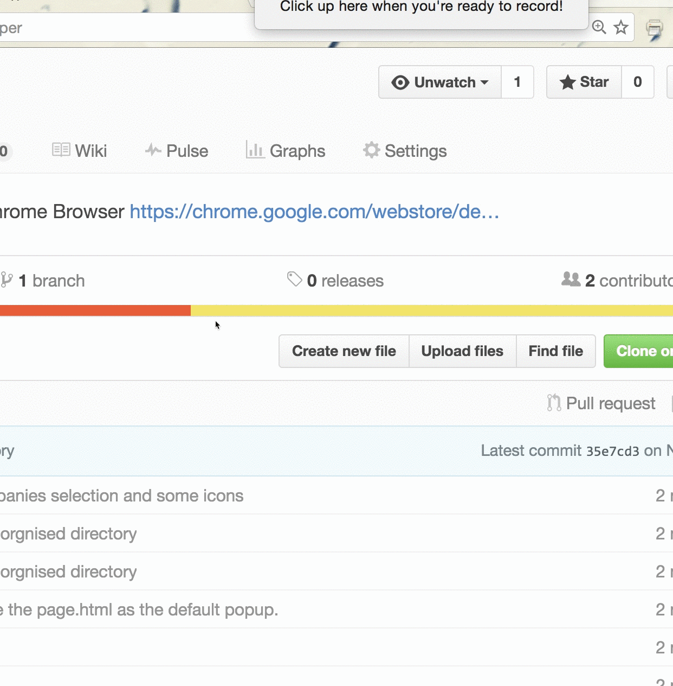

# Express helper

[]
(https://github.com/JSNewbs/express_helper/blob/master/LICENSE.txt)

### A convenient tool to track packages from a Chrome Browser

## Installation

**express helper** The application can be installed from [Chrome Web Store](https://chrome.google.com/webstore/detail/express-helper/mlikhhcddekiepmagohoklonboibillj)

## Instructions

Select the courier service provider, input the package number, and click "查询". The application will return the package information!!

## License

Copyright (C) 2016 [kenshinji](https://github.com/kenshinji) & [Zhgong](https://github.com/Zhgong) [MIT License](./LICENSE.txt)
