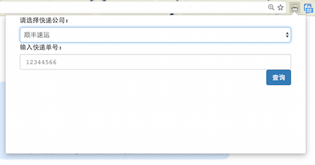

# Express helper

[]

### A convenient way to track your package in Chrome Browser

## Installation

**express helper** can be installed from [Chrome Web Store](https://chrome.google.com/webstore/detail/express-helper/mlikhhcddekiepmagohoklonboibillj)

## Usage

Simply select the express company and input your package number, and click "查询"，and there you go !!!

## License

Copyright (C) 2016 [kenshinji](https://github.com/kenshinji) & [Zhgong](https://github.com/Zhgong) [MIT License](./LICENSE.txt)
